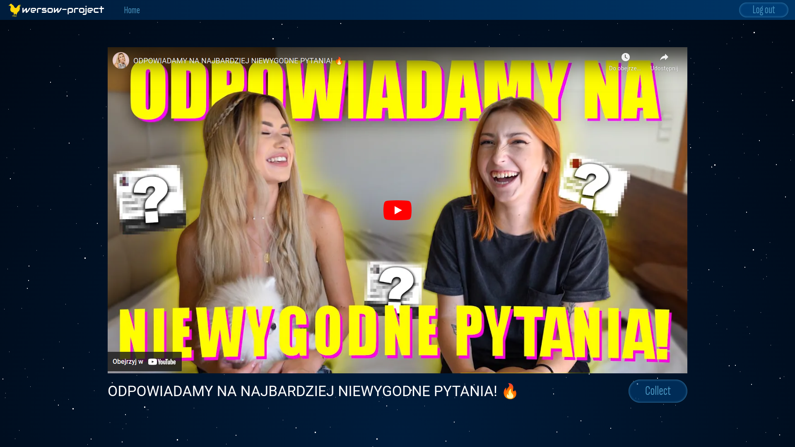

# wersow-project

**wersow-project** is an app that allows you to watch a different video by Wersow (she's a Polish youtuber) every day. Design of the app is inspired by Chicken Invaders.



## Links

- the website: https://wersow.netlify.app/
- api: https://wersow-api.herokuapp.com/
- api documentation: https://wersow-api.herokuapp.com/docs/

## Table of Contents

1. [Technologies](#technologies)
1. [Frontend](#frontend)
   1. [Custom hooks](#custom-hooks)
1. [Backend](#backend)
   1. [Custom commands](#custom-commands)
1. [Sources](#sources)

## Technologies

- Python 3.10
- Django 4.1
- Django REST Framework 3.13
- Typescript 4.8
- React 18.2

## Frontend

### Custom hooks

#### useWindowSize

```javascript
const [windowWidth, windowHeight] = useWindowSize();
```

returns current width and height of the window

## Backend

### Custom commands

- #### Update database with new Wersow's videos that aren't already in the database

  - add all possible videos

  ```properties
  python manage.py loadvideos
  ```

  - add 5 new videos

  ```properties
  python manage.py loadvideos --limit 5
  ```

- #### Change today's video for another random Wersow's video

  ```properties
  python manage.py changetodaysvideo
  ```

## To-do

- [x] every day another random Wersow's video
- [x] authentication
- [ ] ability to collect videos

## Sources

- Design is inspired by Chicken Invaders
- [Parallax Pixel Background Animation](https://youtu.be/aywzn9cf-_U)
- [Logo generator](https://logo.com/)
- [Django API Authentication using JWT Tokens](https://youtu.be/PUzgZrS_piQ)
- [React JWT Authentication](https://youtu.be/OUP-urBy1k4)
- [Loading spinner](https://uiverse.io/timlmit/average-fish-52)
